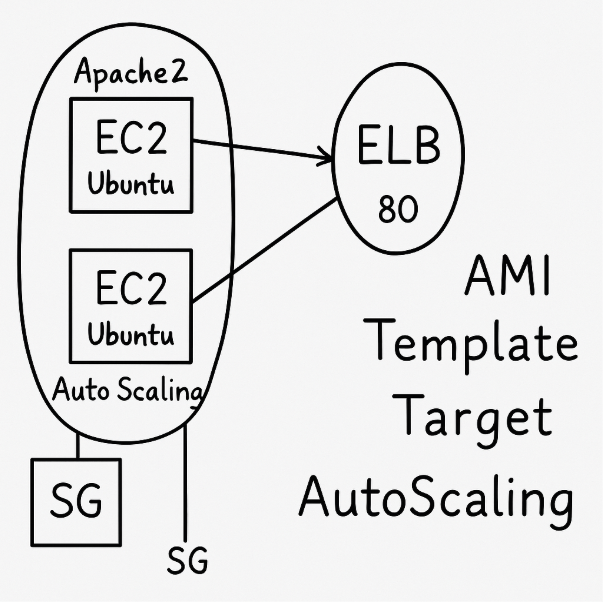

# AWS Auto Scaling Apache Stack

This project deploys an Apache Web Server using EC2, Auto Scaling Group, and Application Load Balancer via AWS CloudFormation.

## 🧱 Architecture


## 🚀 Components
- Launch Template
- EC2 Ubuntu with Apache
- Application Load Balancer (ALB)
- Auto Scaling Group
- Security Groups
- KeyPair

## 🔧 Deployment Steps

### 1. Clone the Repo
```bash
git clone https://github.com/YOUR_USERNAME/aws-autoscaling-apache-stack.git
cd aws-autoscaling-apache-stack
